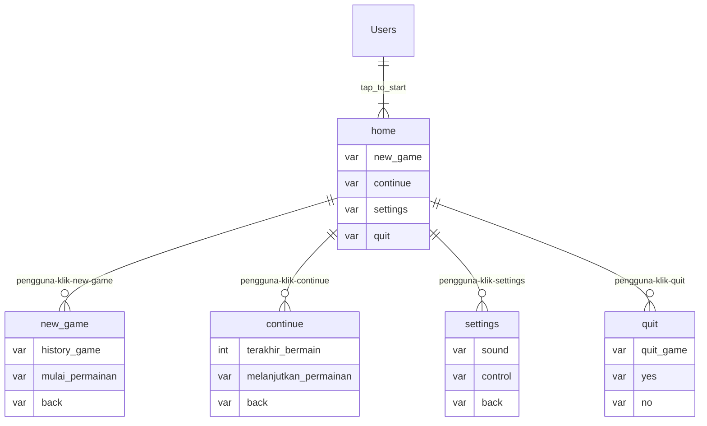

## 1.1. Latar Belakang

Game yang berada di perangkat teknologi menjadi hal yang digemari oleh setiap kalangan, baik itu orang dewasa maupun anak kecil sebagai sarana hiburan ,pengisi waktu luang, bahkan ada yang dijadikan sebagai pekerjaan yang bisa menghasilkan uang.Namun dalam sebuah game pun tidak hanya untuk Pengisi waktu luang maupun penghibur diri, beberapa pesan atau pelajaran pun bisa didapatkan pada sebuah game, seperti bagaimana perjuangan suatu karakter yang selalu gigih dalam menghadapi rintangan atau musuh yang selalu menghadang demi mencapai apa yang dicari dalam game tersebut, melatih cara berfikir dan dapat juga mengasah kereatifitas. Di zaman yang modern ini banyak pengguna media sosial dengan jumlah pengikutnya sangat banyak yang memainkan game hingga game tersebut menjadi viral dan banyak yang memainkannya, sehingga tak heran jika game menjadi software aplikasi yang sangat populer. 
Vice President Corporate Communications Telkomsel, Saki Hamsat Bramono, membeberkan angka yang sangat fantastis. Dirinya menyebutkan, bahwa jumlahnya sendiri hingga miliaran orang di penjuru dunia.

"Di dunia itu sekitar 3 miliar orang yang bermain game, atau 40% dari populasi yang ada di dunia. Asia itu kontribusinya sekitar 50% dari 3 miliar, itu 1,5 miliar orang bermain game di Asia," ungkap Saki, dalam sesi talk show di konferensi DG Con 2022, di Basket Hall Senayan, Jakarta, Jumat (28/10/2022). 

Game memiliki banyak macam bentuk, mulai dari permainan yang sifatnya sederhana hingga yang 
paling kompleks sekalipun.  Semua game saat ini, sudah semakin maju dan modern karena kemajuan teknologi yang terus berkembang. Dengan perkembangan teknologi yang pesat seperti sekarang ini, game menjadi semakin komplit dan juga praktis. Misalnya sekarang orang tidak perlu game console untuk memainkan game, game dapat dimainkan di PC, laptop bahkan gadget smartphone kita bisa memainkan sebuah game. Game yang digemari saat ini adalah game yang bersifat online ,dimana para pemain dapat bermain bersama teman-teman. Di zaman sekarang game dijadikan ajang kompetisi antar pemain agar menjadi pemain terhebat yang memiliki skill dalam bermain yang bagus. Para pemain mengejar peringkat yang ada di dalam game agar di akui sebagai player terkuat. Hal ini menyebabkan banyak dari pemain tersebut  mengalami stress akibat kalah dan sulit menjadi top player dan kebanyakan pemainnya menjadi toxic saat bermain game akibat selalu kalah dan rankingnya tidak kunjung naik. Oleh karena itu perlu adanya game offline yang 
sederhana namun tetap menarik untuk dimainkan.

Game ini menceritakan seorang penjelajah alam semesta yang sedang menjelajah untuk mencari misteri yang ada di setiap alam semesta, namun hal yang tidak disadari oleh si penjelajah saat mencari misteri misteri yang belum terungkap dari dimensi dimensi tersebut adalah adanya makhluk makhluk yang mengganggu saat si penjelajah sedang melakukan pengungkapan misteri. Banyak rintangan dan tantangan yang diberikan oleh para monster dan jenis musuh lain yang menyerang si penjelajah. Namun sang penjelajah tersebut tidak akan menyerah karena sang penjelajah memiliki ambisi besar untuk mengungkapkan misteri apa saja yang ada di dimensi lain.


## 1.2. Deksripsi Teknologi Informasi

aplikasi bertujuan untuk memberikan hiburan para pengguna agar perlahan mereka bisa memainkan game dan bisa merubah pola permainan yang sehat dan lebih baik.ada beberapa jenis teknologi informasi yang dipakai dalam pengerjaan produk teknologi informasi ini, diantaranya:

1. memakai java swing
2. untuk code editor saya menggunakan netbeans


## 1.3. Branding

pada tahap ini saya akan mengeksplorasi branding dari produk yang saya buat.

-Merk : Run And Run
-kata Run And Run diambil dari bahasa inggris yang artinya "lari dan lari" atau bisa diartikan sebagai sebuah pergerakan yang terus bergerak, sesuai dengan produk yang dibuat, yang mencerikatan seorang penjelajah antar dimensi yang sedang menjelajah untuk mengungkapkan misteri di dimensi lain dan di game ini si penjelajah memiliki 2 pilihan dalam melakukan penjelajahan tersebut apakah perlu menghindari musuh yang menyerang atau si penjelajah melakukan penyerangan terhadap musuh pada saat ada musuh.

-Tagline : make it play

-campaign : bagaimana membuat aplikasi game yang penggunanya dapat memainkan karakter dengan sudut pandang pemeran utamanya menjadi penjelajah yang dapat diakses oleh semua pengguna, gunanya untuk menghibur pengguna agar bisa memanfaatkan waktunya dengan baik .

-target user :
	
 *usia 10+ 
 
 *pengguna yang kurang mendapatkan hiburan. 
 
 *pengguna dapat mengkontrol karakter dari game. 
  
-UX theme : 
  
  *sederhana(untuk sekarang)
	
 *warna bervariasi 
	
 *mudah pahami
	
 *mudah untuk dimainkan

 *simple

 *memakai konsep galaxy untuk tampilan awal,karena konsep dari game ini memakai tema antar dimensi

 *warna hitam ,yang mengartikan keluasan dan kemewahan dengan kesan elegan. 

 *didampingi objek objek dengan warna yang cerah
 
## Refernsi Design
Saya mengambil referensi warna dan layout dari aplikasi game soul knight ,seperti gambar dibawah ini:


## 2. User Story

Sebagai | Saya ingin bisa | Sehingga | Prioritas
---|---|---|---
Pengguna | memainkan gamenya | game bisa dimainkan | ⭐⭐⭐⭐⭐
Pengguna | karakter bisa dipilih | pengguna bisa memilih karakter yang ingin dimainkan | ⭐⭐⭐⭐⭐
Pengguna | masuk kedalam game | Pengguna bisa masuk ketampilan utama game | ⭐⭐⭐⭐⭐
Pengguna | karakter bisa di kontrol oleh pengguna  | pengguna bisa menggerakkan karakter sesuka hati | ⭐⭐⭐⭐⭐
Pengguna | menggerakkan karakter yang dimainkan | pengguna bisa menghindari musuh yang lewat di dalam game | ⭐⭐⭐⭐
Pengguna | memilih peta permainan | Pengguna dapat memainkan dengan peta yang dipilihnya  | ⭐⭐⭐⭐
Pengguna | Memainkan game dengan peta yang berbeda | Pengguna dapat main dengan peta yang beda dengan isinya juga berbeda | ⭐⭐⭐
Pengguna | musuh mengenai karakter utama | Pengguna dapat melakukan strategi agar bisa menghindari musuh | ⭐⭐⭐
Pengguna | mengambil senjata  | Pengguna dapat membunuh musuh dengan senjata | ⭐⭐
Pengguna | karakter bisa membidik musuh dengan senjata | Pengguna dapat mematikan musuh dengan senjatanya | ⭐⭐
Pengguna | menampilkan aset aset pendukung di peta | tampilan tidak membosankan| ⭐⭐⭐⭐
Pengguna | aset yang berada di peta bisa berfungsi | aset didalam peta ada fungsinya yang berpengaruh dalam game | ⭐⭐⭐⭐
Pengguna | bisa membeli karakter | bisa mendapatkan karakter baru| ⭐⭐⭐⭐
Pengguna | upgrade kekuatan karakter | kekuatan karakter bertambah | ⭐⭐⭐⭐
Pengguna | membeli aksesoris tambahan pada karakter | memperindah tampilan karakter | ⭐⭐
Pengguna | membeli senjata untuk karakter dalam permainan | pengguna bisa memilih senjata yang ingin dipakai karakternya | ⭐⭐
Pengguna | menampilkan toko yang ada didalam permainan game saat dimulai | pengguna bisa membeli atribut yang dibutuhkan oleh karakter | ⭐⭐⭐
Pengguna | menampilkan atribut atribut yang ada di dalam toko | pengguna bisa melihat macam macam atribut didalam toko | ⭐⭐
Pengguna | menampilkan spesifikasi dari atribut yang ada didalam toko | pengguna bisa melihat keunggulan dan kelemahan dari atribut yang dijual di toko | ⭐⭐
Pengguna | memakai dan melepas atibut yang dipakai karakter | karakter yang dimainkan bisa mengatur atribut yang dipakai | ⭐⭐
Pengguna | saat permainan game dimulai atribut yang dibeli bisa dipakai | atribut yang telah dibeli berguna dan tidak sia sia | ⭐⭐
Pengguna | meng upgrade senjata di dalam permainan game | sehingga senjatanya menjadi lebih bagus | ⭐⭐
Pengguna | di dalam game ada musuh yang berbeda beda di setiap peta | sehingga di setiap peta memiliki cirikhasnya | ⭐⭐
Pengguna | dalam level permainan di ciri kan dengan peta yang berbeda | sehingga pengguna mengetahui level dalam permainan dengan melihat peta | ⭐⭐
Pengguna | permainan semakin sulit saat level semakin tinggi | agar permainan tidak membosankan | ⭐⭐⭐⭐
Pengguna | disetiap akhir level pasti ada raja musuh didalam game nya | permainan menjadi lebih menegangkan | ⭐⭐⭐
Pengguna | raja musuh memiliki darah dan skill yang hebat yang berbeda dengan musuh kecil yang lebih lemah  | sehingga saat melawan raja lebih butuh effort saat mengalahkannya | ⭐⭐
Pengguna | saat mengalahkan raja, karakter mendapatkan kekuatan dan bonus lainnya | sehingga effort yang dikeluarkan saat mengalahkan raja terbalaskan | ⭐⭐⭐
Pengguna | menampilkan lubang hitam antar dimensi untuk melanjutkan ke level selanjutnya | sehingga saat melanjutkan ke level yang berbeda dan peta yang berbeda tidak membosankan | ⭐
Pengguna | ada tembok tembok sebagai penghalang agar bisa berlindung saat diserang musuh | agar membantu karakter dalam permainan | ⭐⭐⭐
Pengguna | ada adrenalin di setiap peta | ada tantangan saat bermain  | ⭐⭐
Pengguna | ada aset tong di dalam game yang berisi koin,energi dan tambahan darah saat tong itu di hancurkan | dapat koin dan darah tambahan yang bermanfaat untuk pengguna dan karakter yang dimainkan | ⭐⭐⭐
Pengguna | memakai senjata pistol yang menembak dari jarak jauh | musuh bisa dimatikan dengan jarak jauh | ⭐⭐⭐
Pengguna | memakai senjata pedang untuk serangan jarak dekat | mematikan lawan dengan jarak dekat | ⭐⭐⭐
Pengguna | ada senjata yang memerlukan energi dari karakter | pengguna tidak selalu unggul dan memiliki kelemahan | ⭐⭐
Pengguna | ada musuh yang memakai senjata | menambah tantangan untuk pemain | ⭐⭐
Pengguna | menampilkan statistik darah ,energi dan koin yang didapat | pengguna mengetahui darah ,energi dan koin yang didapatkan | ⭐⭐⭐⭐
Pengguna | ada harta karun didalam game setelah pindah ke peta selanjutnya yang berisi atribut karakter sebagai bonus | pengguna menjadi semangat saat pindah peta | ⭐⭐
Pengguna | terdapat hewan pendamping didalam karakter yang bisa membantu melawan musuh | sehingga game tidak terlalu susah | ⭐⭐
Pengguna | hewan peliharaan bisa di upgrade kekuatannya | sehingga hewan peliharaan di dalam game menjadi lebih kuat | ⭐⭐⭐
Pengguna | bisa memilih hewan yang ingin didampingi | bisa memilih hewan yang bervariasi yang tidak membosankan | ⭐⭐⭐
Pengguna | ada jebakan berbentuk bom api di daerah arena bermain | pemain harus menghindari jebakan tersebut |⭐⭐⭐
Pengguna | ada bom es di daerah arena permainan | pemain perlu menghindari es tersebut karena jika terkena bisa menjadi es | ⭐⭐⭐
Pengguna | ada tempat sewa karakter lain yang digerakkan oleh komputer | sehingga bisa membantu karakter utama | ⭐
Pengguna | bisa menghancurkan tembakan musuh dengan pedang serangan jarak dekat | fungsi pedang selain untuk menyerang bisa untuk berlindung | ⭐⭐
Pengguna | menembak laser dengan senjata pisto | dalam menyerang terdapat efek warna yang bagus | ⭐
Pengguna | nyawa yang dimiliki karakter hanya 5 nyawa | saat nyawa nya habis karakter perlu mengulangi dari peta tersebut dari awal | ⭐⭐⭐⭐
Pengguna | saat tembakan musuh mengenai karakter pemain maka darah yang dimiliki karakter pemain dikurangi 1 | karakter pemain perlu menghindari tembakan musuh | ⭐⭐⭐⭐
Pengguna | setelah permainan berakhir pemain karakter akan menang jika menuntaskan permainannya dengan mengalahkan musuh dari awal peta hingga akhir | dalam permainan ada akhir yang membahagiakan | ⭐⭐
Pengguna | setelah permainan berakhir akan di jelaskan poin yang didapat dan koin yang didapat | pemain karakter bisa menerima hadiah koin untuk membeli atribut yang ingin dipakai | ⭐⭐

## 3. Struktur Data


## 4. Arsitektur Sistem
```mermaid
flowchart TD
  Database-MySQL <==> tampilan -element_java_swing 
	
```
## 5. Teknologi, Library, dan Framework

Saya menggunakan java swing untuk merancang produk teknologi informasi ini.


